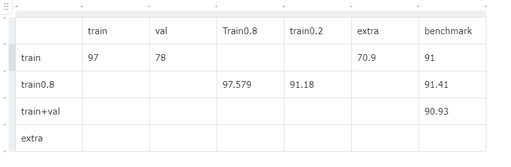
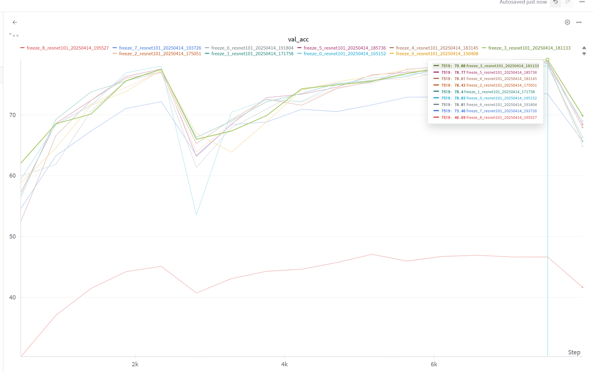
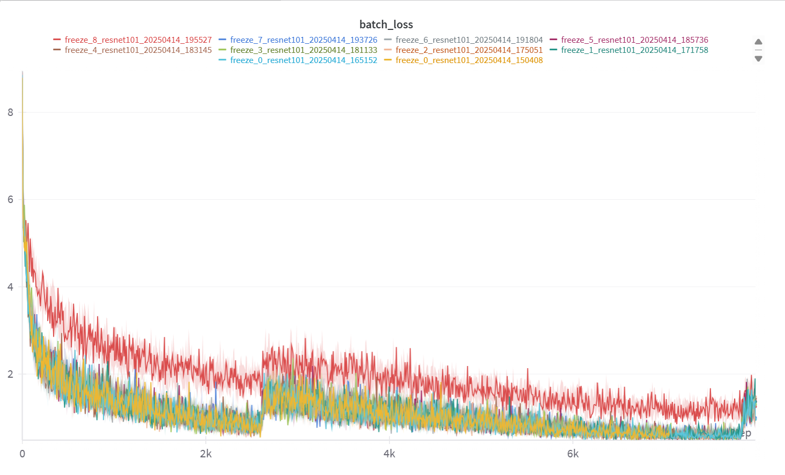
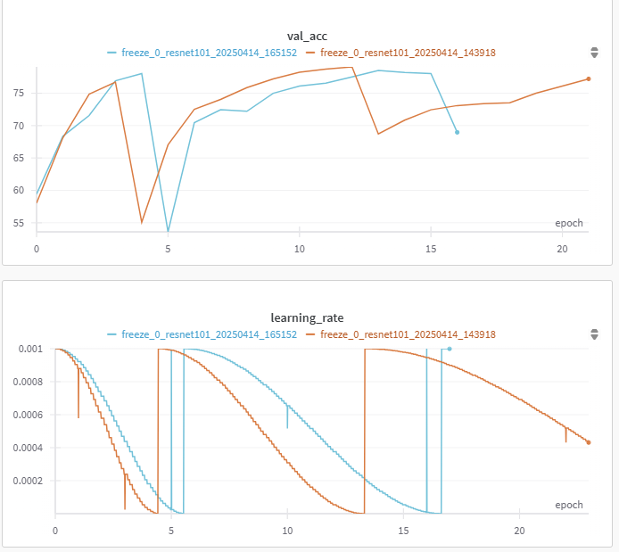
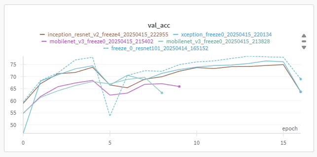
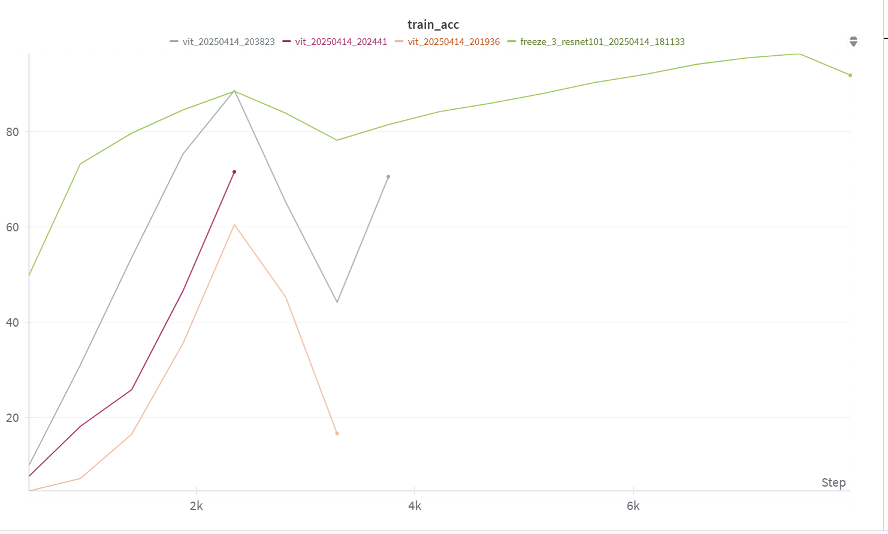
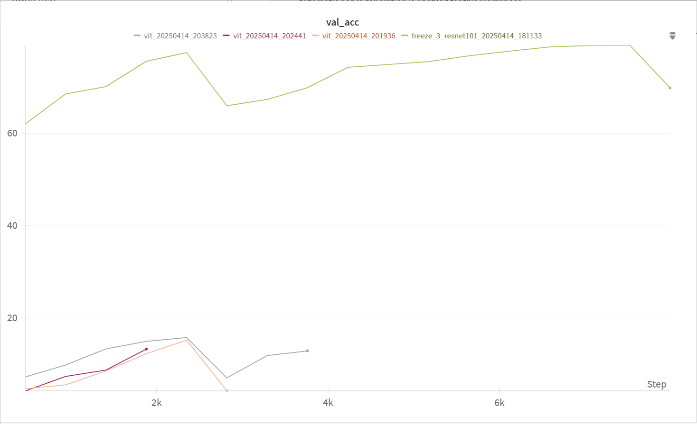

### 思路简介
针对数据集采取了以下尝试：
1. 首先通过简单尝试得到以下结论：mchar_val与mchar_train的分布并不统一，天池平台的测试集分布更接近mchar_train
2. 尝试在互联网上寻找类似数据集，找到SVHN提供的extra数据集，数据量较mchar_train高一个数量级，发现比赛要求不使用额外数据集，遂作罢
3. 尝试使用AutoAugmentation策略，发现效果不如baseline原始augmentation策略，猜想是AutoAugmentation根据在验证集上的表现来选择最优的augmentation策略，但由于mchar_val与mchar_train分布不一致，AutoAugmentation反而导致在测试集上效果差

针对baseline骨干提取特征网络加单层线性分类层的思路，我做了以下改进尝试：
1. 采用网格调参法，选择了最优的学习率和scheduler的T_mult（即从最大学习率到最小学习率变化所需的轮次）
2. 尝试了不同的骨干网络架构，包括mobilenet resnet101 inception_resnet_v2 xcpetion ViT.
    其中mobilenet在训练集合验证集的准确率都较低，推测是参数量较小导致的；
    ViT在训练集上几乎可以达到1的准确率，但在验证集上维持在20以下；猜想是ViT的参数量过大导致更容易在训练集上过拟合，而3W张图片的数据集过小难以满足Transformer架构的训练需求
    resnet101 inception_resnet_v2 xception等模型在训练集上均能达到97左右的准确率，在验证集上78-79。提交到天池后单模型准确率可达到91.5左右
3. 尝试了冻结骨干网络的部分层数（如resnet101在冻结前30层时效果最佳）
4. 尝试了test time augmentation（TTA）技术，即在测试时对输入图像进行多次随机变换，并对预测结果取平均，实测效果不如无TTA，但主要的问题在于我选择的变换不太合适，TTA讲道理应该是有用的
5. 模型结果融合，分别尝试了多模型简单投票，以及多模型线性层输出加权平均；实测简单投票更好，将冻结了不同层数的7个resnet101模型简单投票结果可达到92.67，线性层输出加权平均的结果为92.46
6. 将resnet101 xception inception_resnet_v2的预测结果融合，实测效果更好，融合结果为93.30

针对Yolo算法做了以下尝试：
1. 简单训练，单模型可达92.5
2. 与前述resnet101 xception inception_resnet_v2的预测结果投票融合，最终得到最高分93.65
### 对于训练集验证集测试集的分析
将训练集按8 2拆分。注意到在0.8份的训练集上训练后，在剩余的0.2份训练集的表现约等于在测试集上的表现，而显著优于在测试集上的表现。说明训练集和测试集分布较为相似，且训练集的分布与测试集的分布有较大差异。

### 对resnet101冻结层数的定量实验
可以看到在冻结3层（这里的3层并不对应resnet101总共的101层，而是pytorch库实现resnet101时大致把resnet101分成了10层）模型在验证集上有最好的效果.

而当冻结层数大于6时，模型效果显著下滑。这是容易理解的，在ImageNet上预训练的resnet很显然不能很好的捕捉到关于数字的信息，然而最底层提取边缘轮廓等信息的层数仍然有效。因此最好的效果在冻结前三层时出现。

### 基于网格搜索的超参数选择
受限于算力资源我并没有进行完整的网格搜索，主要靠少量测试加经验推断，以下是一个确认schedulerT0时的示例：

在lr=0.001时，分别设置scheduler_T0为40和50，表现在学习率上是做余弦函数的周期（图二）
可以看到尽管在T0为40时训练的周期数更少，但是在第二个完整的scheduler周期后，在验证集上取得了更优的成绩（图一）。

### 骨干网络尝试
#### MobileNet_v3 Inception_ResNet_v2 Xception ResNet101
可以看到Inception_ResNet_v2 Xception ResNet101都有较好的效果，而mobilenet准确率显著更低。

#### ViT
我本来对ViT寄予厚望，认为新的就是好的，可惜结果并不如人意。

Vision Transformer是最近一两年出现的一种新的网络结构，使用了Transformer的思想来处理图像特征。把一张图片拆成16*16的格子，每个格子称为一个图像块（patch），将这些图像块展平后通过线性投影转换为特征向量（称为patch embedding），并在序列开头添加一个可学习的分类token。与CNN不同，ViT没有使用卷积操作，而是通过多头自注意力机制让所有图像块之间建立全局依赖关系。为了保留位置信息，每个patch embedding还会叠加可学习的位置编码（position embedding）。VisionTransformer也可被作为特征提取的骨干网络。

以下是我使用ViT架构作为骨干网络的实验部分。
在训练集的准确率与ResNet相当

在测试集的准确率上，ViT的准确率较低。

个人推测是因为ViT的参数量更大，更容易过拟合。且16*16的patch不能很好的捕捉数字全局的信息，靠叠加上的poseembedding然后通过cross attention的方式理解被拆分成两个部分的一个数字比较困难。
### yolo
借助前人提供的预处理代码（https://github.com/wu-jianlong/tianchi_mchar），和ultralytics原版的yolo代码，我训练了yolo模型识别单位字符，单模型可达92.5.与前述resnet101 xception inception_resnet_v2的预测结果投票融合，最终得到最高分93.65